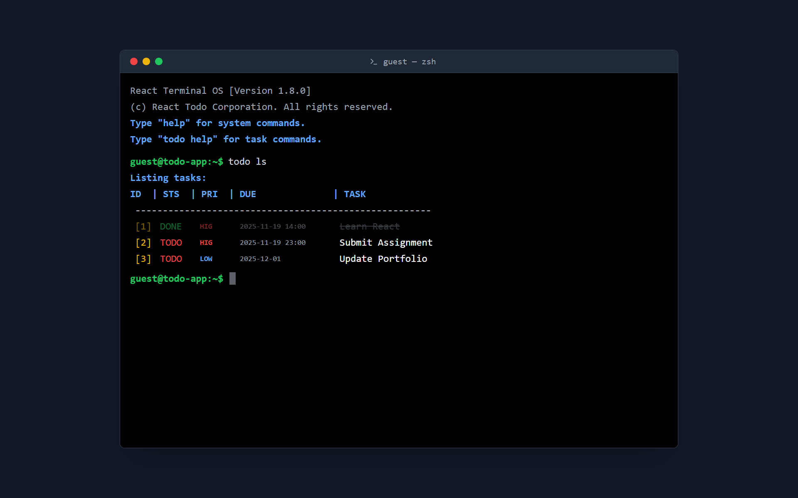
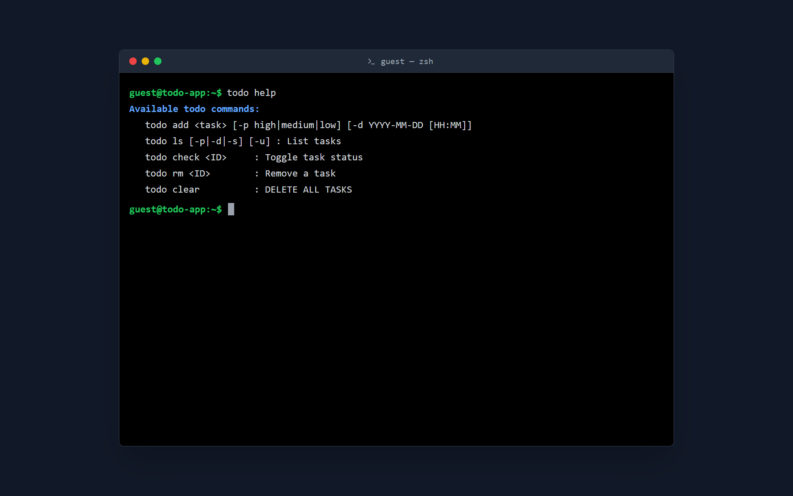
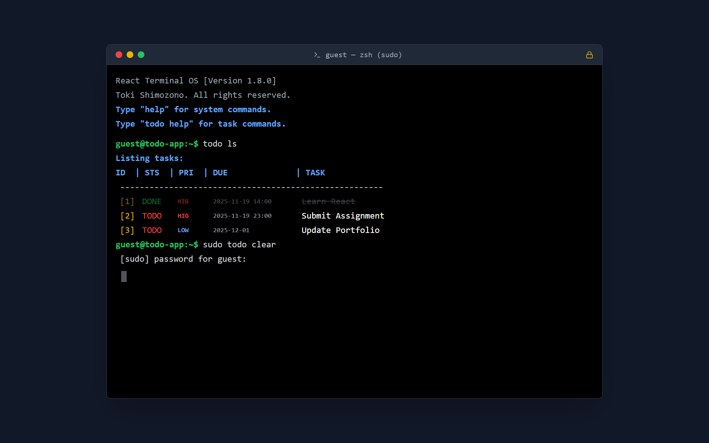

# Terminal Todo (React CLI Style)


**Developer-First Task Manager: "No Mouse, Just Code."**

[👉 デモアプリはこちら (GitHub Pages)](https://r23062.github.io/TodoApp/)

---

## 💡 Concept & Story

**「コーディング中にマウスを触りたくない。」**

エンジニアとして開発に没頭しているとき、Todoリストを確認するためにキーボードから手を離し、マウスでGUIアプリを操作することに「コンテキストスイッチのコスト」を感じていました。

そこで、**「ターミナルから一歩も出ずにタスク管理ができるアプリ」** を目指して開発しました。
LinuxのZsh/Bashのような操作感をWeb上で再現し、開発者が最もストレスなく使えるUI/UXを追求しています。

---

## ✨ Features

* [cite_start]**完全なCLI体験**: 本物のターミナルのような操作感とビジュアル [cite: 1]。
* [cite_start]**コマンドベース管理**: `todo add`, `ls`, `rm` などのUnixライクなコマンド体系 [cite: 1]。
* [cite_start]**引数パース処理**: `-p` (Priority) や `-d` (Due Date) などのオプション引数を解析し、詳細な設定が可能 [cite: 1]。
* [cite_start]**擬似的な権限管理**: 重要な操作（全削除や終了）には `sudo` とパスワード認証を要求するギミックを搭載 [cite: 1]。
* [cite_start]**レスポンシブ対応**: スマートフォンでも操作しやすいレイアウト [cite: 1]。

---

## 📸 Screen Shots

| Command Line Interface | Help & Documentation |
|:---:|:---:|
|  |  |
| **タスク一覧と操作画面** | **充実したヘルプコマンド** |

| Sudo & Security (Gimmick) |
|:---:|
|  |
| **管理者権限 (sudo) モード** |

---

## 🚀 Usage (使い方)

画面上のどこかをクリックすると、入力カーソルにフォーカスが当たります。
[cite_start]コマンドを入力し、`Enter` キーを押して実行してください [cite: 1]。

### 基本ルール
* [cite_start]タスク管理に関するコマンドは、先頭に `todo` を付ける必要があります（例: `todo add ...`） [cite: 1]。
* [cite_start]システム操作（画面クリアなど）は、プレフィックスなしで実行できます（例: `clear`） [cite: 1]。

---

## 📖 Command Reference

### 1. システムコマンド (Global Commands)
[cite_start]これらは `todo` を付けずに直接入力します 。

| コマンド | 説明 |
|:---|:---|
# Terminal Todo (React CLI Style)


**Developer-First Task Manager — No Mouse, Just Code.**

[👉 デモアプリ (GitHub Pages)](ここにGitHub PagesのURLを貼り付けてください)

---

## 💡 コンセプト

「コーディング中にマウスを触りたくない。」

開発に集中しているとき、キーボードから手を離してマウス操作するのは小さくないコストです。本プロジェクトは、ターミナル操作だけでタスク管理が完結することを目指した、開発者向けのタスク管理アプリです。

Linux のシェル（Zsh/Bash）に近い操作感を Web 上で提供し、ショートカットやコマンドベースの操作でストレスなく使える UX を追求しています。

---

## ✨ 主な特徴

- **CLI ライクな操作感**: ターミナル風の UI とコマンド体系。
- **コマンドベース管理**: `todo add`, `todo list`, `todo rm` など Unix ライクなコマンド群。
- **オプション対応**: `-p`（優先度）や `-d`（期限）など、引数で詳細設定可能。
- **擬似 sudo モード**: 危険操作は `sudo` とパスワード確認でガード。
- **レスポンシブ対応**: モバイルでも閲覧・操作可能なレイアウト。

---

## 📸 スクリーンショット

| コマンド画面 | ヘルプ画面 |
|:---:|:---:|
|  |  |

| Sudo モード |
|:---:|
|  |

---

## 🚀 使い方（概要）

画面内の任意の場所をクリックすると入力欄にフォーカスが当たります。コマンドを入力して `Enter` キーで実行してください。

- タスク操作系のコマンドは `todo` プレフィックスが必要です（例: `todo add ...`）。
- 画面操作（`clear` など）はプレフィックスなしでも実行できます。

---

## 📖 コマンドリファレンス

### システムコマンド（プレフィックス不要）

| コマンド | 説明 |
|---|---|
| `help` | システムコマンドのヘルプを表示します。 |
| `clear` | 画面のログ表示をクリアします（データは消えません）。 |
| `reload` | ページをリロードします。 |
| `exit` | [要 sudo] ターミナルセッションを終了します。 |

### タスク管理コマンド（`todo` プレフィックス）

| コマンド | 引数・オプション | 説明 |
|---|---:|---|
| `todo help` | - | タスクコマンドのヘルプを表示します。 |
| `todo list` | `ls` も可 | タスク一覧を表示します。 |
| `todo add` | `<タスク名>` | 新しいタスクを追加します。 |
| `todo check` | `<ID>` | 指定 ID のタスクを完了/未完了に切替えます。 |
| `todo rm` | `<ID>` | 指定 ID のタスクを削除します。 |
| `todo priority` | `<ID> <level>` | 優先度を変更します（high, medium, low）。 |
| `todo due` | `<ID> <date>` | 期限を変更します（YYYY-MM-DD または YYYY-MM-DD HH:MM）。 |
| `todo clear` | - | [要 sudo] すべてのタスクを削除します。 |

---

## 🔧 詳細オプション

### `todo add` の構文

```
todo add <タスク名> [-p <優先度>] [-d <期限>]
```

- `-p` (Priority): `high` / `medium` / `low`
- `-d` (Due Date): `YYYY-MM-DD` または `YYYY-MM-DD HH:MM`

使用例:

```bash
# 優先度「高」で追加
todo add "バグ修正" -p high

# 期限を指定して追加
todo add "レポート提出" -d 2025-12-31

# 優先度と日時を指定して追加
todo add "リリース作業" -p high -d "2025-12-31 15:00"
```

### `todo ls` の表示オプション

- `-u`: 未完了のみ表示
- `-p`: 優先度順ソート（High > Medium > Low）
- `-d`: 期限順ソート（早い順）
- `-s`: 状態順ソート（未完了 > 完了）

使用例:

```bash
# 未完了タスクのみを優先度順に表示
todo ls -u -p
```

---

## 🔐 Sudo モード（管理者権限）

`exit` や `todo clear` のような危険操作は `sudo` が必要です。`sudo` 実行時にパスワード入力が求められます（開発用のギミックとして固定パスワードが設定されている場合があります）。

使用例:

```bash
sudo todo clear
[sudo] password for guest:
# （パスワードを入力して Enter）
```

---

## 💡 Tips

- コマンド履歴はスクロールで遡れます。
- 画面外の余白をクリックしても自動で入力にフォーカスします（オートフォーカス）。
- `ls` は `list`、`rm` は `delete` / `del` のようなエイリアスに対応しています。

---

## 🛠 技術スタック

- フロントエンド: React + TypeScript
- ビルド: Vite
- スタイリング: Tailwind CSS
- アイコン: Lucide React
- 配備: GitHub Pages

---

## ⏳ 開発情報

- 開発期間: 2025-10-15 〜 2025-11-19
- 工数: 約 20 時間

---

## 📜 ライセンス

MIT License

Copyright (c) 2025 Toki Shimozono

Permission is hereby granted, free of charge, to any person obtaining a copy
of this software and associated documentation files (the "Software"), to deal
in the Software without restriction, including without limitation the rights
to use, copy, modify, merge, publish, distribute, sublicense, and/or sell
copies of the Software, and to permit persons to whom the Software is
furnished to do so, subject to the following conditions:

The above copyright notice and this permission notice shall be included in all
copies or substantial portions of the Software.

THE SOFTWARE IS PROVIDED "AS IS", WITHOUT WARRANTY OF ANY KIND, EXPRESS OR
IMPLIED, INCLUDING BUT NOT LIMITED TO THE WARRANTIES OF MERCHANTABILITY,
FITNESS FOR A PARTICULAR PURPOSE AND NONINFRINGEMENT. IN NO EVENT SHALL THE
AUTHORS OR COPYRIGHT HOLDERS BE LIABLE FOR ANY CLAIM, DAMAGES OR OTHER
LIABILITY, WHETHER IN AN ACTION OF CONTRACT, TORT OR OTHERWISE, ARISING FROM,
OUT OF OR IN CONNECTION WITH THE SOFTWARE OR THE USE OR OTHER DEALINGS IN THE
SOFTWARE.